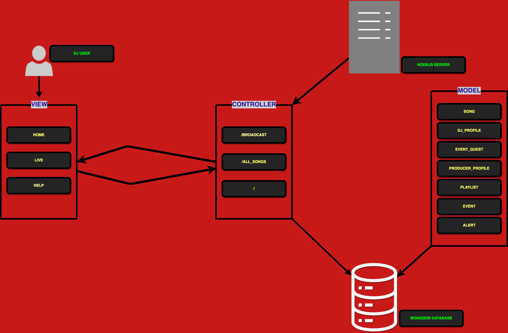
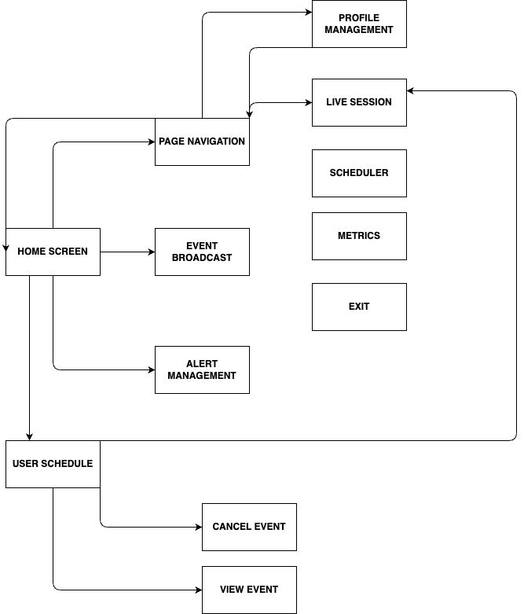
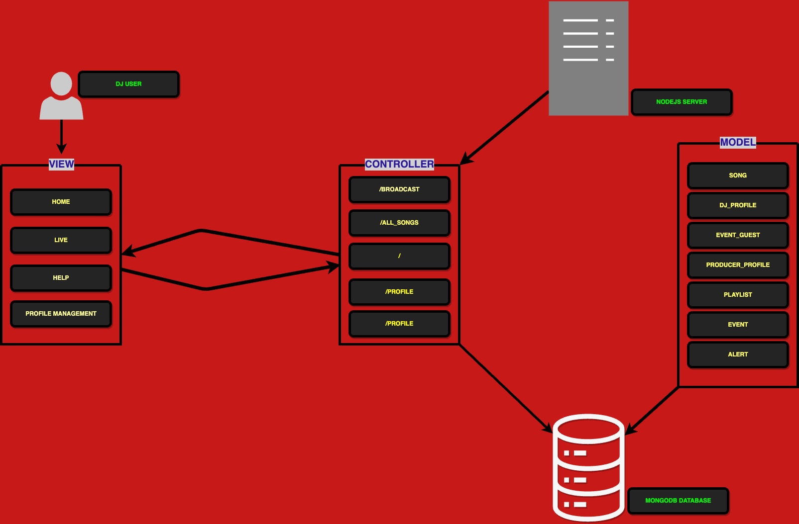
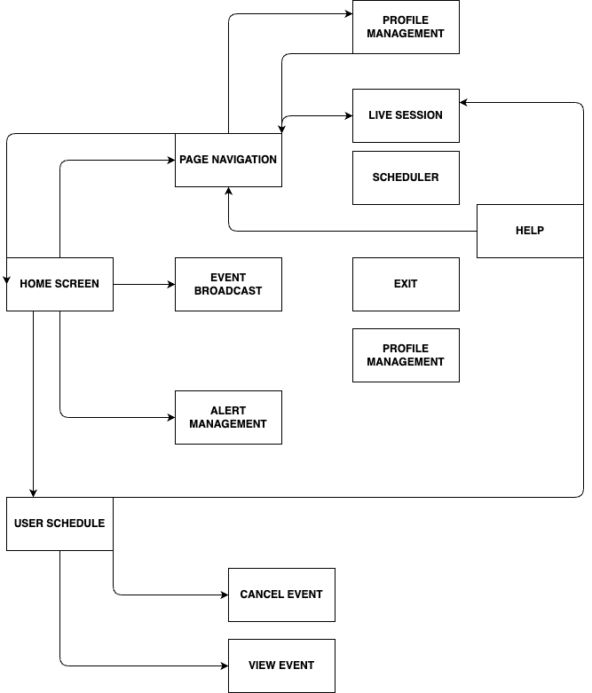

# SWE 432 Fall 2024 - Assignment 4 Rubric

## Total Points: 140/150

### 1. Design (30 points)
- [x] **Initial Component Diagram (10 points):**  
  - Developed an initial component diagram prior to coding showing an appropriate architecture for a Node.JS/EJS implementation in a relative MVC style.  
  - Provided a short explanation documenting the components.

>  This diagram illustrates the Model-View-Controller (MVC) architecture for a Node.js application integrated with MongoDB and EJS templates. The View represents the user interface components, including EJS templates like home, live, and help, which interact directly with users, such as DJs accessing their dashboards. The Controller serves as the intermediary between the View and the Model, managing the flow of data by handling routes such as /broadcast, /all_songs, and /. It processes user inputs, retrieves or updates data from the Model, and ensures the appropriate response is delivered to the View. The Model defines the application’s data structure and interacts with the MongoDB database, managing collections such as song, dj_profile, event_guest, producer_profile, playlist, event, and alert. The Database is the MongoDB storage layer that holds all persistent data for the application, including profiles, events, playlists, and songs. The diagram highlights the separation of concerns, where user actions flow through the Controller, interact with the Model for data processing, and deliver results to the user-facing View, all handled by the Node.js server.

`Points Earned: 10/10`

- [x] **Initial Sequence Diagram (10 points):**  
  - Developed an initial sequence diagram prior to coding showing the module flow.  
  - Provided a short explanation explaining the flow. 

> The flowchart outlines the navigation and interaction structure for a system. It starts from the Home Screen, branching into key modules such as Page Navigation, Event Broadcast, and Alert Management. From Page Navigation, users can access modules like Profile Management, Live Session, Scheduler, Metrics, and the Exit option. The Event Broadcast section includes functionalities like Cancel Event and View Event, while the Alert Management section manages user notifications and actions. This flow ensures streamlined user interaction through clearly defined paths and functionalities.

`Points Earned: 10/10`

- [x] **Updated Diagrams (10 points):**  
  - Updated the diagrams to match the delivered system.

`Points Earned: 10/10`

---

### 2. EJS Implementation (50 points)
- [x] **EJS Syntax (20 points):**  
  - Demonstrates a good understanding of EJS syntax.

`Points Earned: 20/20`  

- [x] **Data Passing (10 points):**  
  - Successfully passed data from the server to EJS templates.
  
`Points Earned: 10/10`

- [x] **EJS Views (10 points):**  
  - Created dynamic EJS views for the radio station application.  
  - Utilized EJS layouts to create all pages.

`Points Earned: 10/10`

- [x] **Directory Structure (10 points):**  
  - Organized the project directory properly, separating routes, views, and static files.

`Points Earned: 10/10`

---

### 3. Functionality (20 points)
- [x] **Application Features (20 points):**  
  - All features of the application work as expected.  
  - Links lead to the correct pages, buttons perform their intended actions, and data is displayed correctly.

> 2 point loss because alerts reading and clearing not fully implemented 

`Points Earned: 18/20`

---

### 4. Database Implementation (30 points)
- [x] **Database Setup (10 points):**  
  - Successful setup of MongoDB, including installation, configuration, and connection to the web application.

`Points Earned: 10/10`
  
- [x] **Data Model Schema Design (10 points):**  
  - Developed a MongoDB schema accurately representing the application's data model (e.g., songs, DJs, playlists, listener preferences).
  
`Points Earned: 10/10`
  
- [x] **Frontend and Backend Data Sync (10 points):**  
  - [x] Migrated existing data to the new database structure, ensuring all previously hard-coded data is now stored and retrieved from the database.

  - [x] Verified frontend displays are updated to reflect backend data accurately after CRUD operations, ensuring data consistency.

> 3 point loss because not all CRUD operations reflect on the UI but do so in the database

`Points earned: 7/10`

---

### 5. Session Management and Continuity (20 points)
- [x] **Data Persistence and Restoration (10 points):**  
  - Ensured session data is persistent across page reloads and the user's interaction state is maintained (e.g., favorite songs list remains intact after reload).
> 4 point loss because user cannot resume session without confirming and changes are sent to db

`Points earned: 6/10`

- [x] **Logout and Session Clearing (10 points):**  
  - Implemented a logout mechanism that clears the current session while preserving user data integrity in the database.

> Exit button closes everything

`Points earned: 9/10`