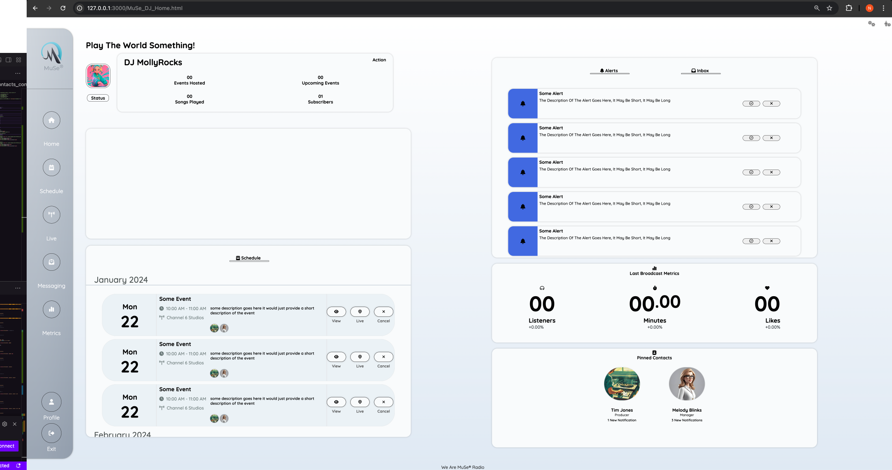
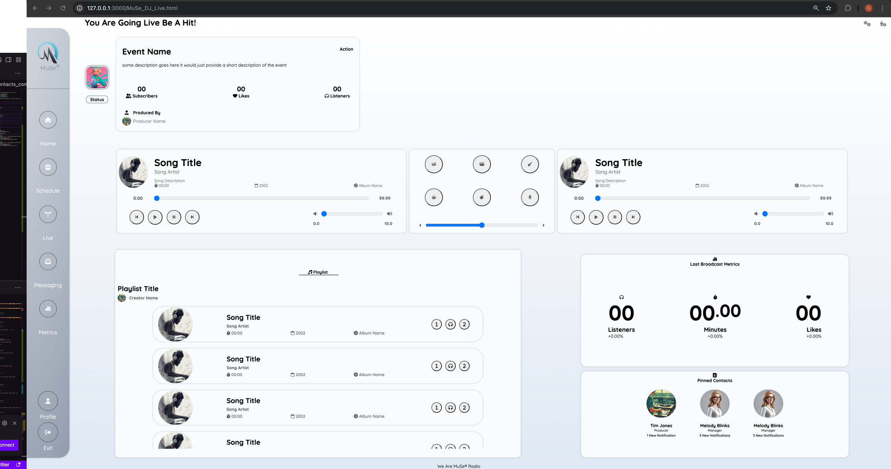

# Assingment 2 Submissison

## HTML: 50 pts
> Code runs successfully without error: 6 pts\

`Code runs succefully, all links jump to relevant screens` 
`NO 404 Error or Forbidden Error`

> Document Structure (Doctype, Head, Body): 10 pts

`All pages and screens structured with head and body tags in HTML 5 Syntax` 

> HTML5 Semantic Elements: 10 pts

`All elements are properly defined and semantically correct, divs and span tags used for containers` 

>HTML Elements Usage:

> Lists: 6 pts

`Navigation implemented using lists, same for profiles in the guest list for events` 

> Table: 6pts

> Form: 6 pts

> Validations: 6 pts

`Input elements validated, particularly ranges`

## Basic CSS: 30 pts

> Elements styled with CSS accurately: 10 pts

`All elements requiring styling are done properly with the appropriate CSS selectors both inline and external styles`<

> Includes styling: 10 pts

`Styles defined for as many elements as possible`
`Colors used for fonts and backgrounds`
`Margins defined for spacing between elements`

> NO errors or syntax mistakes: 5 pts

`No syntax errors in css`

> Proper formatting and clean look: 5 pts

`CSS written progressively to match flow of html`

## More CSS: 10 pts

> Includes at least one advance CSS element: 5pts

`Flexboxes and grids used styling cards throughout the site with the appropriate use of inline, internal and external styles`

## Role Based: 10 pts

> Submitted the screenshots of screens with description of use: 6 pts

`Screenshots submitted to blackboard with copies in ./submission folder`

> Elements used in HTML and CSS satisfy role specifications: 2 pts
`All code done in HTML 5 and CSS 3`

> Complexity and functionality required for profile displayed accurately: 2 pts

`DJ capable of hosting live sessions and has access to most features in this iteration`

> Covered using at least one primary (or core) screen

`Implemented screens for home page and streaming sessions fully`

## Screenshots

